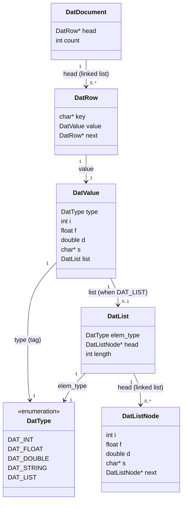
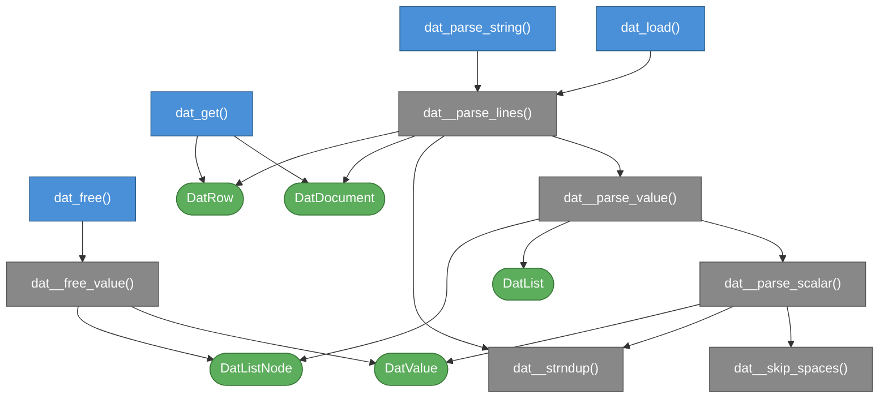

# skn_dat.h

Header-only parser for `.dat` files. Drop `skn_dat.h` into your project and include it.

---

## File format

```
# comment
key value
```

- **Key**: plain identifier (letters, digits, underscores), no quotes.
- **Value**: one of the types below, on the same line.
- **Comments**: lines whose first non-whitespace character is `#` are ignored.

### Value types

| Literal example        | Parsed type |
|------------------------|-------------|
| `42`, `-7`             | `int`       |
| `3.14f`, `0.5f`        | `float`     |
| `3.14`, `1.0`          | `double`    |
| `"hello world"`        | `string`    |
| `[1, 2, 3]`            | `int` list  |
| `[0.5f, 1.2f]`         | `float` list|
| `[1.0, 2.0]`           | `double` list|
| `["a", "b"]`           | `string` list|

Lists are **homogeneous**: the type is inferred from the first element; mismatched elements cause the row to be skipped.

### Example

```
# example.dat
count       42
offset      -7
ratio       0.5f
pi          3.14159
greeting    "hello world"
scores      [10, 20, 30, 40]
weights     [0.5f, 1.2f, 3.0f]
names       ["alice", "bob", "carol"]
```

---

## Usage

```c
#define SKN_DAT_IMPLEMENTATION
#include "skn_dat.h"

int main(void) {
    DatDocument *doc = dat_load("data.dat");

    DatRow *row = dat_get(doc, "scores");
    if (row && row->value.type == DAT_LIST) {
        for (DatListNode *n = row->value.list.head; n; n = n->next)
            printf("%d\n", n->i);
    }

    dat_free(doc);
}
```

Define `SKN_DAT_IMPLEMENTATION` in **exactly one** translation unit before the include.

---

## Public API

### `dat_load`
```c
DatDocument *dat_load(const char *filename);
```
Opens `filename`, reads it entirely, and parses it. Returns `NULL` on I/O failure.

### `dat_parse_string`
```c
DatDocument *dat_parse_string(const char *text);
```
Parses a `.dat` document from a null-terminated string. Returns `NULL` on allocation failure.

### `dat_get`
```c
DatRow *dat_get(DatDocument *doc, const char *key);
```
Linear search through the document for `key`. Returns the first matching `DatRow`, or `NULL`.

### `dat_free`
```c
void dat_free(DatDocument *doc);
```
Frees all memory owned by the document, including keys, string values, list nodes, and the document itself. Safe to call with `NULL`.

---

## Data model



---

## Function dependency map

Boxes with **sharp corners** are functions; boxes with **rounded corners** are data types.
Colors: **blue** = public API, **grey** = internal, **green** = data types.


