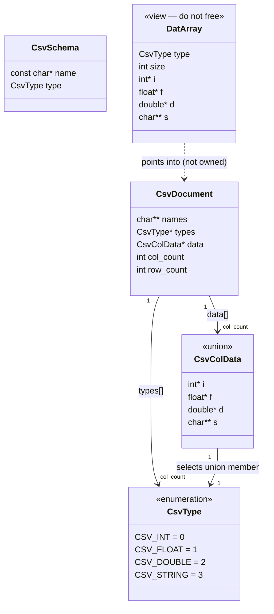
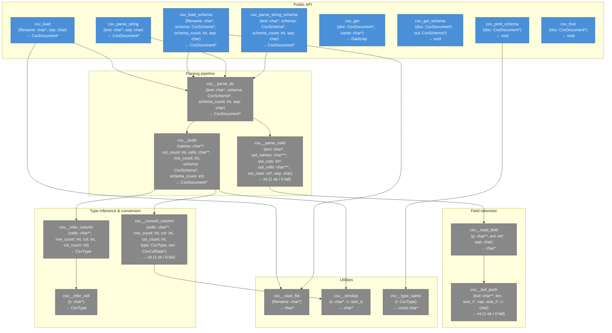

# skn_csv.h

Header-only CSV parser with automatic type inference and configurable separator.

---

## Usage

```c
#define SKN_CSV_IMPLEMENTATION
#include "skn_csv.h"

CsvDocument *doc = csv_load("data.csv", ',');
DatArray col = csv_get(doc, "age");
for (int i = 0; i < col.size; i++)
    printf("%d\n", col.i[i]);
csv_free(doc);
```

Define `SKN_CSV_IMPLEMENTATION` in **exactly one** translation unit.

---

## Data model



---

## Call graph

Colors: **blue** = public API · **grey** = internal · **green** = data types.
Each node shows: function name / parameter list / return type.



---

## Local variables

For each function, the local variables it declares and their initial values where relevant.

### csv__strndup
| Variable | Type | Initial value |
|----------|------|---------------|
| `copy` | `char *` | `malloc(n + 1)` |

### csv__buf_push
| Variable | Type | Initial value |
|----------|------|---------------|
| `t` | `char *` | `realloc(*buf, *cap)` — temp for safe realloc |

### csv__read_field
| Variable | Type | Initial value |
|----------|------|---------------|
| `len` | `size_t` | `0` |
| `cap` | `size_t` | `32` |
| `buf` | `char *` | `malloc(cap)` |
| `s` | `const char *` | `*p` |

### csv__infer_cell
| Variable | Type | Initial value |
|----------|------|---------------|
| `p` | `const char *` | `s` — walking pointer |

### csv__infer_column
| Variable | Type | Initial value |
|----------|------|---------------|
| `t` | `CsvType` | `CSV_INT` — running most-general type |
| `ct` | `CsvType` | set per iteration by `csv__infer_cell` |

### csv__convert_column
| Variable | Type | Initial value |
|----------|------|---------------|
| `arr` | `int *` / `float *` / `double *` / `char **` | `malloc(row_count * sizeof(...))` — type depends on `CsvType` |

### csv__parse_cells
| Variable | Type | Initial value |
|----------|------|---------------|
| `p` | `const char *` | `text` (advanced past BOM if present) |
| `col_count` | `int` | `0` |
| `names_cap` | `size_t` | `8` |
| `names` | `char **` | `calloc(names_cap, sizeof(char *))` |
| `eol` | `int` | `0` — reused for each field/row read |
| `row_count` | `int` | `0` |
| `cells_cap` | `size_t` | `col_count * 16` |
| `cells` | `char **` | `calloc(cells_cap, sizeof(char *))` |
| `old_cap` | `size_t` | previous `cells_cap` before doubling — used for `memset` |
| `col` | `int` | `0` — column index within the current row |

### csv__build
| Variable | Type | Initial value |
|----------|------|---------------|
| `doc` | `CsvDocument *` | `malloc(sizeof(CsvDocument))` |
| `type` | `CsvType` | set per column — from schema or `csv__infer_column` |
| `found` | `int` | `0` — set to `1` if column name matches schema |

### csv__read_file
| Variable | Type | Initial value |
|----------|------|---------------|
| `f` | `FILE *` | `fopen(filename, "r")` |
| `size` | `long` | `ftell(f)` after `fseek(SEEK_END)` |
| `buf` | `char *` | `malloc(size + 1)` |
| `nread` | `size_t` | `fread(buf, 1, size, f)` |

### csv__parse_do
| Variable | Type | Initial value |
|----------|------|---------------|
| `names` | `char **` | output from `csv__parse_cells` |
| `col_count` | `int` | output from `csv__parse_cells` |
| `cells` | `char **` | output from `csv__parse_cells` |
| `row_count` | `int` | output from `csv__parse_cells` |
| `doc` | `CsvDocument *` | return value of `csv__build` |

### csv_load / csv_load_schema
| Variable | Type | Initial value |
|----------|------|---------------|
| `buf` | `char *` | return value of `csv__read_file` |
| `doc` | `CsvDocument *` | return value of `csv__parse_do` |

### csv_get
| Variable | Type | Initial value |
|----------|------|---------------|
| `arr` | `DatArray` | built locally, fields set inside the matching loop iteration |
