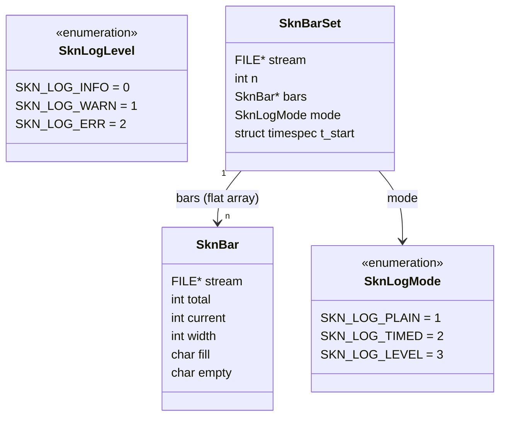

# skn_bar.h

Header-only terminal progress bar — single bar and multi-bar container.
Drop `skn_bar.h` into your project and include it.

---

## Usage

```c
#define SKN_BAR_IMPLEMENTATION
#include "skn_bar.h"
```

Define `SKN_BAR_IMPLEMENTATION` in **exactly one** translation unit.
`SknLogMode` and `SknLogLevel` are defined here when `skn_log.h` is not already included;
both headers can safely coexist in the same translation unit.

---

## Single bar

```c
SknBar *bar = sbar_init(100, 40, stdout);
for (int i = 0; i <= 100; i++) { sbar_update(bar, i); do_work(); }
sbar_finish(bar);
sbar_free(bar);
```

Output: `[################..........] 62%  62/100` (redrawn in-place with `\r`).

## Bar set

```c
SknBarSet *set = sbars_init(3, stdout);
sbars_set_mode(set, SKN_LOG_LEVEL);
sbars_config(set, 0, 200, 40);
sbars_start(set);
sbars_start_timer(set);
sbars_update(set, 0, 42);
sbars_log(set, SKN_LOG_INFO, "worker 0 at milestone\n");
sbars_end_timer(set, SKN_LOG_INFO, "batch done in %t\n");
sbars_finish(set);
sbars_free(set);
```

All output while bars are active must go through `sbars_log()` / `sbars_end_timer()`.
Recommended pattern: bar set on `stdout`, logger (`skn_log.h`) on a file — fully independent.

---

## Data model



---

## Function dependency map

Colors: **blue** = public API · **grey** = internal · **green** = data types.

```mermaid
flowchart TD
    classDef pub      fill:#4a90d9,stroke:#2c5f8a,color:#fff
    classDef internal fill:#888888,stroke:#555555,color:#fff
    classDef dtype    fill:#5cad5c,stroke:#3a7a3a,color:#fff

    %% ── Single bar — public ─────────────────────────────────────────
    subgraph SBAR["Single bar"]
        sbar_init["sbar_init()"]:::pub
        sbar_free["sbar_free()"]:::pub
        sbar_set_chars["sbar_set_chars()"]:::pub
        sbar_update["sbar_update()"]:::pub
        sbar_step["sbar_step()"]:::pub
        sbar_finish["sbar_finish()"]:::pub
    end

    %% ── Bar set — public ────────────────────────────────────────────
    subgraph SBARS["Bar set"]
        sbars_init["sbars_init()"]:::pub
        sbars_free["sbars_free()"]:::pub
        sbars_set_mode["sbars_set_mode()"]:::pub
        sbars_config["sbars_config()"]:::pub
        sbars_set_chars["sbars_set_chars()"]:::pub
        sbars_start["sbars_start()"]:::pub
        sbars_update["sbars_update()"]:::pub
        sbars_step["sbars_step()"]:::pub
        sbars_start_timer["sbars_start_timer()"]:::pub
        sbars_log["sbars_log()"]:::pub
        sbars_end_timer["sbars_end_timer()"]:::pub
        sbars_finish["sbars_finish()"]:::pub
    end

    %% ── Rendering internals ─────────────────────────────────────────
    subgraph RENDER["Rendering"]
        bar__render["bar__render()"]:::internal
        barset__redraw_one["barset__redraw_one()"]:::internal
        barset__redraw_all["barset__redraw_all()"]:::internal
        barset__clear["barset__clear()"]:::internal
    end

    %% ── Log formatting internals ────────────────────────────────────
    subgraph LOGFMT["Log formatting"]
        barset__print_prefix["barset__print_prefix()"]:::internal
        bar__print_timestamp["bar__print_timestamp()"]:::internal
        bar__print_level["bar__print_level()"]:::internal
        bar__elapsed_ns["bar__elapsed_ns()"]:::internal
        bar__format_elapsed["bar__format_elapsed()"]:::internal
    end

    %% ── Data types ──────────────────────────────────────────────────
    SknBar(["SknBar"]):::dtype
    SknBarSet(["SknBarSet"]):::dtype
    SknLogMode(["SknLogMode"]):::dtype
    SknLogLevel(["SknLogLevel"]):::dtype

    %% ── Single bar edges ────────────────────────────────────────────
    sbar_init    --> SknBar
    sbar_free    --> SknBar
    sbar_set_chars --> SknBar
    sbar_update  --> bar__render
    sbar_update  --> SknBar
    sbar_step    --> sbar_update
    sbar_finish  --> bar__render
    sbar_finish  --> SknBar

    %% ── Bar set edges ───────────────────────────────────────────────
    sbars_init        --> SknBarSet
    sbars_init        --> SknBar
    sbars_free        --> SknBarSet
    sbars_set_mode    --> SknBarSet
    sbars_set_mode    --> SknLogMode
    sbars_config      --> SknBarSet
    sbars_set_chars   --> SknBarSet
    sbars_start       --> bar__render
    sbars_start       --> SknBarSet
    sbars_update      --> barset__redraw_one
    sbars_update      --> SknBarSet
    sbars_step        --> sbars_update
    sbars_start_timer --> SknBarSet
    sbars_log         --> barset__clear
    sbars_log         --> barset__print_prefix
    sbars_log         --> barset__redraw_all
    sbars_log         --> SknLogLevel
    sbars_end_timer   --> barset__clear
    sbars_end_timer   --> barset__print_prefix
    sbars_end_timer   --> barset__redraw_all
    sbars_end_timer   --> bar__elapsed_ns
    sbars_end_timer   --> bar__format_elapsed
    sbars_end_timer   --> SknLogLevel
    sbars_finish      --> sbars_update

    %% ── Rendering internals edges ───────────────────────────────────
    barset__redraw_one --> bar__render
    barset__redraw_all --> bar__render
    bar__render        --> SknBar

    %% ── Log formatting internals edges ──────────────────────────────
    barset__print_prefix --> bar__print_timestamp
    barset__print_prefix --> bar__print_level
    barset__print_prefix --> SknLogMode
    bar__print_level     --> SknLogLevel
    bar__elapsed_ns      --> SknBarSet
```


