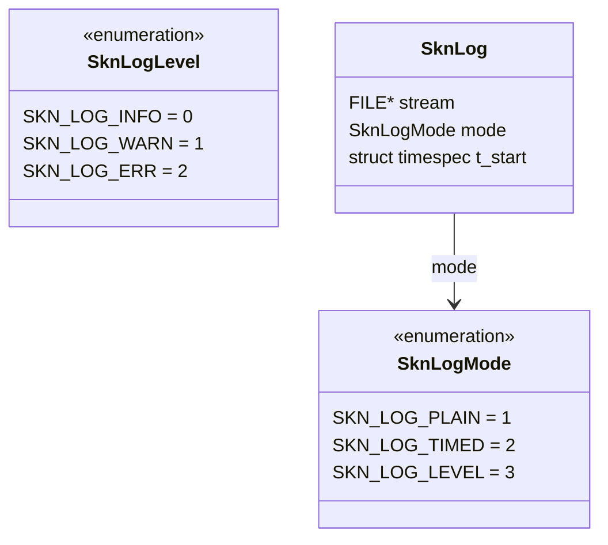

# skn_log.h

Header-only logger. Drop `skn_log.h` into your project and include it.

---

## Modes

| Constant | Prefix emitted |
|---|---|
| `SKN_LOG_PLAIN` | *(none)* |
| `SKN_LOG_TIMED` | `[YYYY-MM-DD HH:mm:ss]` |
| `SKN_LOG_LEVEL` | `[YYYY-MM-DD HH:mm:ss] INFO/WARNING/ERROR -` |

---

## Usage

```c
#define SKN_LOG_IMPLEMENTATION
#include "skn_log.h"

SknLog *log = slog_init(SKN_LOG_LEVEL, stdout);
slog_print(log, SKN_LOG_INFO, "starting\n");
slog_start_timer(log);
do_work();
slog_end_timer(log, SKN_LOG_INFO, "done in %t\n");
slog_free(log);
```

Define `SKN_LOG_IMPLEMENTATION` in **exactly one** translation unit.

---

## Data model



---

## Function dependency map

Colors: **blue** = public API · **grey** = internal · **green** = data types.

```mermaid
flowchart TD
    classDef pub      fill:#4a90d9,stroke:#2c5f8a,color:#fff
    classDef internal fill:#888888,stroke:#555555,color:#fff
    classDef dtype    fill:#5cad5c,stroke:#3a7a3a,color:#fff

    %% ── Public API ──────────────────────────────────────────────────
    slog_init["slog_init()"]:::pub
    slog_free["slog_free()"]:::pub
    slog_print["slog_print()"]:::pub
    slog_start_timer["slog_start_timer()"]:::pub
    slog_end_timer["slog_end_timer()"]:::pub
    _found_secret["_found_secret()"]:::pub

    %% ── Internal helpers ────────────────────────────────────────────
    log__print_timestamp["log__print_timestamp()"]:::internal
    log__print_level["log__print_level()"]:::internal
    log__elapsed_ns["log__elapsed_ns()"]:::internal
    log__format_elapsed["log__format_elapsed()"]:::internal

    %% ── Data types ──────────────────────────────────────────────────
    SknLog(["SknLog"]):::dtype
    SknLogMode(["SknLogMode"]):::dtype
    SknLogLevel(["SknLogLevel"]):::dtype

    %% ── Edges ───────────────────────────────────────────────────────
    slog_init         --> SknLog
    slog_free         --> SknLog
    slog_start_timer  --> SknLog

    slog_print        --> SknLog
    slog_print        --> SknLogLevel
    slog_print        --> log__print_timestamp
    slog_print        --> log__print_level

    slog_end_timer    --> SknLog
    slog_end_timer    --> SknLogLevel
    slog_end_timer    --> log__elapsed_ns
    slog_end_timer    --> log__format_elapsed
    slog_end_timer    --> log__print_timestamp
    slog_end_timer    --> log__print_level

    log__print_level  --> SknLogLevel
    log__elapsed_ns   --> SknLog
```


